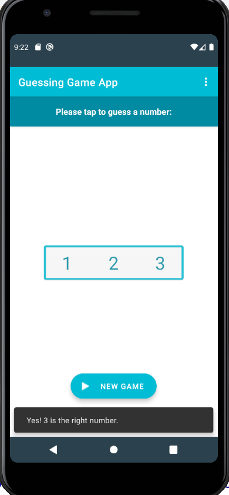

# GuessingGame

Random guessing game created for my Android Development course.   
User picks a number between 1-3. The program responds whether that number was correct or not.

# Features
* Personalized icon launcher
* Extended Floating Action Button
* Snackbar that includes a specific response depending on which number was pressed

# Icon Launcher

# Guessing Game Screenshot

